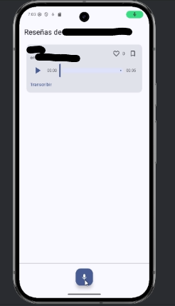
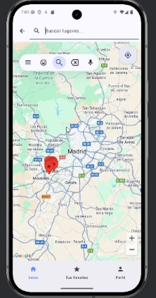

# HearMe 🎤📍

**HearMe** es una aplicación Android pensada para dejar reseñas de audio en restaurantes y otros lugares, vinculadas a la ubicación del usuario.  
La idea principal es que las opiniones no se limiten al texto escrito: los usuarios pueden grabar su experiencia en audio y compartirla de forma más natural y rápida.

## 🚀 Funcionalidad principal
- **Geolocalización:** la app detecta tu ubicación y te muestra los restaurantes cercanos, a estos se les puede dejar una reseña de audio pulsandolos.  
- **Reseñas en audio:** grabación de opiniones directamente desde la app.  
- **Transcripción automática:** un botón permite enviar el audio a la API, que lo transcribe a texto para hacerlo más accesible y fácil de buscar.  
- **Visualización:** cada reseña muestra tanto el audio original como el texto transcrito (cuando está disponible).  

## 🛠️ Arquitectura
- **App Android (Kotlin/Java):** interfaz, grabación de audio, gestión de reseñas y geolocalización.  
- **Backend (Node.js/Express en Heroku):** API encargada de procesar los audios y devolver la transcripción.  
- **Firebase:**  
  - Auth (autenticación de usuarios)  
  - Storage (almacenamiento de audios)  
  - Firestore (metadatos de reseñas)  
  - App Check (protección de recursos)  
- **Proveedor ASR (Speech-to-Text):** servicio externo de pago que realizaba la transcripción (actualmente retirado).  

## ⚠️ Estado actual
La aplicación no está en funcionamiento completo porque dependía de servicios de pago que ya no están disponibles.  

## 📸 Capturas de la aplicación

### Pantalla de inicio
Aquí el usuario puede ver los bares cercanos y le aparece la opción de reseñar.

### Pantalla de reseña
Vista donde se muestran las reseñas grabadas en el restaurante en concreto y la opción de grabar una reseña y transcribir los audios a texto.

### Pantalla de mapa
Vista donde se muestra el mapa dependiendo de tu ubicación, con pines indicando los restaurantes cercanos

La aplicación tenía mas funciones y pestañas, pero estas son las principales para ver como funcionaba y se veía la aplicación cuando estaba en funcionamiento.

---

👨‍💻 **Autor:** Tristan Kempes  
🔗 [LinkedIn](https://www.linkedin.com/in/tristan-kempes-ares-685270333)
